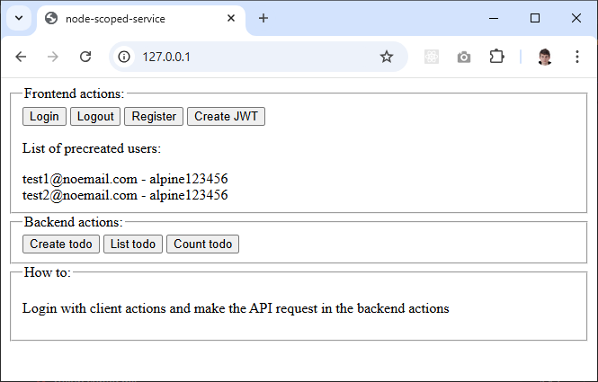

# node-scoped-service

> Using Appwrite on a backend side by using JWT Authentication



## ASP.Net Core Scoped Services for NodeJS

When working with appwrite you can passthrough the client session from a frontend to the backend side by using [JWT Login](https://appwrite.io/docs/products/auth/jwt)

**Frontend code**

```tsx
import * as Appwrite from 'appwrite';

const client = new Appwrite.Client();
client
    .setEndpoint("https://cloud.appwrite.io/v1")
    .setProject("672f8382002190141578");

const account = new Appwrite.Account(client);

const session = await account.createEmailPasswordSession(
    email,
    password
);

const { jwt } = await account.createJWT();
```

**Backend code**

```tsx
import {
  Client,
  Databases,
  Storage,
} from "node-appwrite";

const client = new Client();
client
    .setEndpoint(CC_APPWRITE_ENDPOINT_URL)
    .setProject(CC_APPWRITE_PROJECT_ID)
    .setJWT(jwt)
    .setLocale("en-GB");
const databases = new Databases(client);
const storage = new Storage(client);
```

The problem is if you are working with Express there is no way to skip the `Client` object manual creation on each request. After creation, you will have to keep the reference in each function arguments so the code will be dirty.

**Express code**

```tsx
app.post('/todos', async (req, res) => {
    const jwt = req.headers.authorization.split(' ')[1];

    const client = new Client();
    client
        .setEndpoint('https://[APPWRITE_ENDPOINT]/v1')
        .setProject('[APPWRITE_PROJECT_ID]')
        .setJWT(jwt)

    const database = new Database(client);
    const account = new Account(client);

    const { title } = req.body;

    const newTodo = await database.createDocument(collectionId, 'unique()', {
      title
    });

    res.status(200).json(newTodo);
});
```

Usually, a common backend application has many CRUD routes. Therefore, automating client creation is necessary; otherwise, our code will become disorganized...

## The solution

The dependency injection pattern will organize the data flow

```tsx

export class TodoDbService {

    private readonly appwriteService = inject<TAppwriteService>(TYPES.appwriteService);

    findAll = async () => {
        return await resolveDocuments<ITodoRow>(listDocuments(CC_APPWRITE_TODO_COLLECTION_ID));
    };

    findById = async (id: string) => {
        return await this.appwriteService.databases.getDocument<ITodoDocument>(
            CC_APPWRITE_DATABASE_ID,
            CC_APPWRITE_TODO_COLLECTION_ID,
            id,
        );
    };

    create = async (dto: ITodoDto) => {
        return await this.appwriteService.databases.createDocument<ITodoDocument>(
            CC_APPWRITE_DATABASE_ID,
            CC_APPWRITE_TODO_COLLECTION_ID,
            this.appwriteService.createId(),
            dto,
        );
    };

    update = async (id: string, dto: Partial<ITodoDto>) => {
        return await this.appwriteService.databases.updateDocument<ITodoDocument>(
            CC_APPWRITE_DATABASE_ID,
            CC_APPWRITE_TODO_COLLECTION_ID,
            id,
            dto,
        );
    };

    remove = async (id: string) => {
        return await this.appwriteService.databases.deleteDocument(
            CC_APPWRITE_DATABASE_ID,
            CC_APPWRITE_TODO_COLLECTION_ID,
            id,
        );
    };

};
```

The JWT token for Authentication should be passed to AppwriteService by using constructor arguments

```tsx
export const AppwriteService = scoped(class {
//                            ^^^^^^^^

  public client: Client = null as never;
  public storage: Storage = null as never;
  public databases: Databases = null as never;

  public createId = () => {
    return ID.unique();
  };

  public upsertDocument = async (
    COLLECTION_ID: string,
    id: string,
    body: object
  ) => {
    try {
      return readTransform(
        await this.databases.createDocument(
          CC_APPWRITE_DATABASE_ID,
          COLLECTION_ID,
          id,
          writeTransform(body)
        )
      );
    } catch (error) {
      if (error instanceof AppwriteException) {
        return readTransform(
          await this.databases.updateDocument(
            CC_APPWRITE_DATABASE_ID,
            COLLECTION_ID,
            id,
            writeTransform(body)
          )
        );
      }
      throw error;
    }
  };

  constructor(public jwt: string) {
    console.log("AppwriteService CTOR", jwt)
    const client = new Client();
    client
      .setEndpoint(CC_APPWRITE_ENDPOINT_URL)
      .setProject(CC_APPWRITE_PROJECT_ID)
      .setJWT(jwt)
      .setLocale("en-GB");
    const databases = new Databases(client);
    const storage = new Storage(client);
    {
      this.client = client;
      this.databases = databases;
      this.storage = storage;
    }
  }

});

export type TAppwriteService = InstanceType<typeof AppwriteService>;
```

The JWT token should be taken from HTTP Context when the request recieved on a express side. Here comes the scoped service feature: by calling `AppwriteService.runInContext(async () => {` you will reinstantiate the AppwriteService in the current `async_hooks` execution context with the new `constructor` argument which contains actual JWT token

```javascript
import { ioc, AppwriteService } from './lib';

...

router.get("/api/v1/count_todo", (req, res) => {
  const jwtToken = getAuthToken(req);
  AppwriteService.runInContext(async () => {
    micro.send(res, 200, await ioc.todoRequestService.getTodoCount());
  }, jwtToken);
});
```
